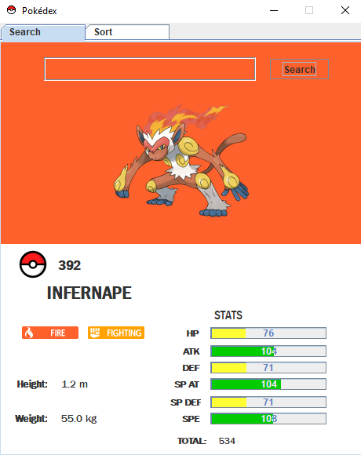

# Pokédex

The project is a Java application that provides information about the basic characteristics of Pokémon up to the ninth generation. The app uses a local csv file as a data source.
The data was obtained directly from [https://pokeapi.co/](https://pokeapi.co/).

This was a school project for my third semester of software engineering. I only translated the interface to English, so the source code has some variable names in spanish.

## Features
**Search**: The app provides a search tab where users can enter the name or id of a Pokémon to get detailed information.
<table>
  <tr>
    <td align="center">
      
    </td>
    <td align="center">
      
    </td>
  </tr>
</table>

**Sort**: The sort tab allows sorting a complete list that includes all Pokémon according to different criteria such as name, id, and statistics.

  

## System Requirements
[Java](https://www.java.com/download/ie_manual.jsp "Java") 8 or higher.

##  Execution
1. Download the ZIP file of the project.
2. Run the "Pokedex-1.0.jar" file from the root folder with a double click or using the following command:

   `java -jar Pokedex-1.0.jar`

## Usage
**Search:**
- Select the "Search" tab (it is the tab with which the program starts).
- Enter the name or Pokédex number of the Pokémon you want to search for.
- Click the "search" button.

For generating Pokémon images, it is necessary to be connected to the internet.

**Sort:**
- Select the "Sort" tab.
- Choose the sorting criterion (name, Pokédex number, attack, etc.).
- Select the sorting type ("Ascending" is selected by default).
- Click the sort button.

## CSV File
The file was generated using the class "ConsultaAPI.java" (it is in Pokedex\src\main\java). It is not necessary to generate the file because it already exists as a jar file resource, however feel free to test the generation by running the class. An internet connection is required to access the PokeApi.
